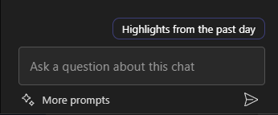

---
demo:
  title: 'Demostración: Copilot en Teams.'
---

[Volver al índice](https://microsoftlearning.github.io/MS-4012-Microsoft-Copilot-Web-Based-Interactive-Experience-for-Executives/)

# Copilot en Teams

## Configuración de la demostración

Para garantizar una demostración fluida, elige una de las siguientes opciones de configuración:

**Opción A: Resumen de la reunión**

Las instrucciones para la configuración de la demostración se pueden encontrar en [aquí](https://microsoft.seismic.com/Link/Content/DCFPQWmT2DMXC8WJjgjP4H44GWXG). En concreto, consulta las páginas 5-10, que explican cómo configurar la reunión de Teams (Project Avalon) a la que se hace referencia en la demostración siguiente.

> **IMPORTANTE:**
> - La configuración de la demostración de la opción A requerirá al menos 4 personas (opcionalmente 6).
> - Realiza esto con tu equipo antes de la entrega planeada.
> - Una vez completado, puedes hacer referencia a esta reunión de Teams para futuras entregas.
> - Si no puede realizar el trabajo de preparación por cualquier motivo, haz referencia a la demostración de la opción B.

**Opción B: Chat de Teams**

Esta opción de demostración no tiene intencionadamente ningún requisito previo a la configuración. Sin embargo, deberás aprovechar uno de tus propios hilos de chat de Teams preexistentes. Asegúrate de que no haya información confidencial compartida en este chat antes de usarla para la demostración.


## Opción A: demostración del resumen de un reunión

### Puntos de conversación

"Ahora, mostraré lo que llamamos un resumen de una reunión en Teams.

Esta es una reunión con mis compañeros. No podemos mostrarte nuestra verdadera reunión por motivos de confidencialidad, pero esta es una reunión ficticia que grabé con mi equipo donde hablamos del lanzamiento de un producto ficticio llamado Project Avalon.

El resumen se basaba en la transcripción de la grabación. Muestra quién estaba involucrado y cuándo hablaban. También hay un resumen de lo que hablamos. Copilot ha organizado mi reunión por secciones para que sea más fácil encontrar lo que estoy buscando.

Ahora puedo hacer preguntas de Copilot y obtener más información sobre esta reunión. Por ejemplo, veamos lo que se ha hablado y cuáles son los elementos de acción para cada persona".

### Pasos de la demostración

1. Cambia a la pestaña del explorador con Microsoft Teams abierto a la reunión **Project Avalon launch meeting**.

    > **IMPORTANTE:** no muestres reuniones ni chats que contengan datos confidenciales.

1. Selecciona la pestaña **Resumen**.

    

1. Señala los **oradores**.
1. Selecciona **Temas**.

    

1. Selecciona **Capítulos**.

    

1. En la esquina superior derecha, selecciona **Copilot**.

    

1. En el cuadro de texto **Pregúntame sobre esta reunión**, copia y pega la solicitud:

    ```text
    Can you list action items and owners in a table?
    ```

1. Selecciona **Enviar**.
1. En el cuadro de texto **Pregúntame sobre esta reunión**, copia y pega la solicitud: 

    ```text
    Did anyone strongly oppose the decision, and how do you know?
    ```
    
1. Selecciona **Enviar**.
1. En el cuadro de texto **Pregúntame sobre esta reunión**, copia y pega la solicitud:

    ```text
    Based on the transcript, when would you recommend we launch the product and why?
    ```

1. Selecciona **Enviar**.

## Opción B: chat de Teams

### Puntos de conversación

"Ahora, mostraré cómo Copilot puede mejorar nuestra experiencia del chat de Teams.

Este es un hilo de chat con mis compañeros. Copilot ayuda a resumir los aspectos destacados de nuestro chat, lo que facilita la puesta al día de los puntos importantes sin tener que leer todos los mensajes.

Ahora puedo hacer preguntas de Copilot para obtener información más específica del chat. Por ejemplo, vamos a averiguar cuáles son los puntos abiertos y cómo debemos continuar con los pasos siguientes.

Además, puedo redactar una respuesta y usar Copilot para refinarla, asegurándome de que mi mensaje sea claro y conciso. Esto resulta especialmente útil para garantizar una comunicación eficaz dentro del equipo".

### Pasos de la demostración

1. Busca un hilo de chat de Teams en el que no hayas compartido ninguna información confidencial. Selecciona la opción **Abrir chat en una nueva ventana**.

    

1. Con el chat de Teams abierto en una nueva ventana, selecciona **Abrir Copilot** en la esquina superior derecha.

    

1. En el panel de chat de Copilot que se abre, selecciona **Momentos destacados del día anterior*** para obtener un resumen rápido de los chats del día anterior.

    

1. En el cuadro de texto **hacer una pregunta sobre este chat**, copia y pega la solicitud: 

    ```text
    What are the open items?
    ```
    > **Nota:** no dude en elegir un ejemplo de solicitud alternativo que creas que se dirigirá mejor a tu público.   

1. En el historial de chats, en el cuadro de texto **Escribir un mensaje**, empieza a escribir una respuesta. **No lo envíes todavía.**

1. Con el borrador de respuesta, selecciona Copilot en el cuadro de texto **Escribir un mensaje**.

       

1. Experimenta con las opciones **Reescribir** y **Ajustar** copiloto para demostrar aún más las funcionalidades de los copilotos.

         

[Volver al índice](https://microsoftlearning.github.io/MS-4012-Microsoft-Copilot-Web-Based-Interactive-Experience-for-Executives/)
